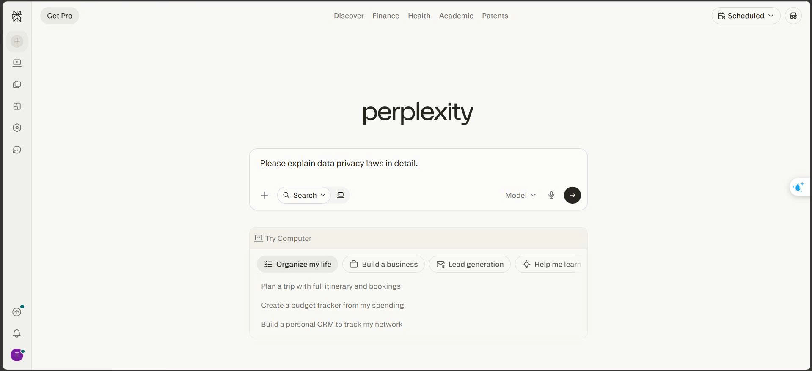
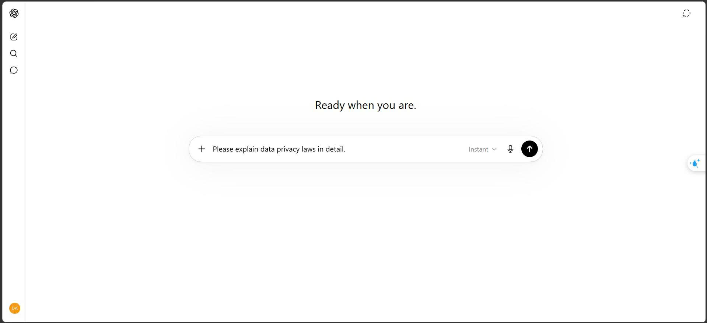
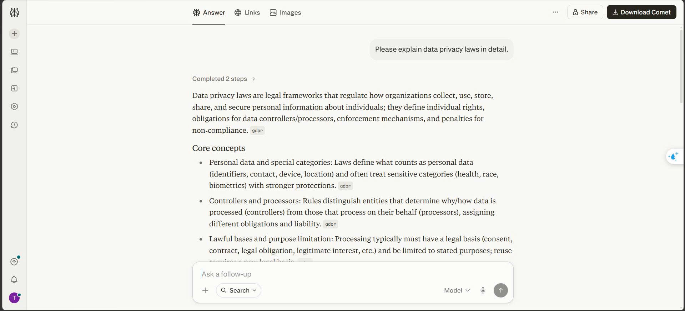
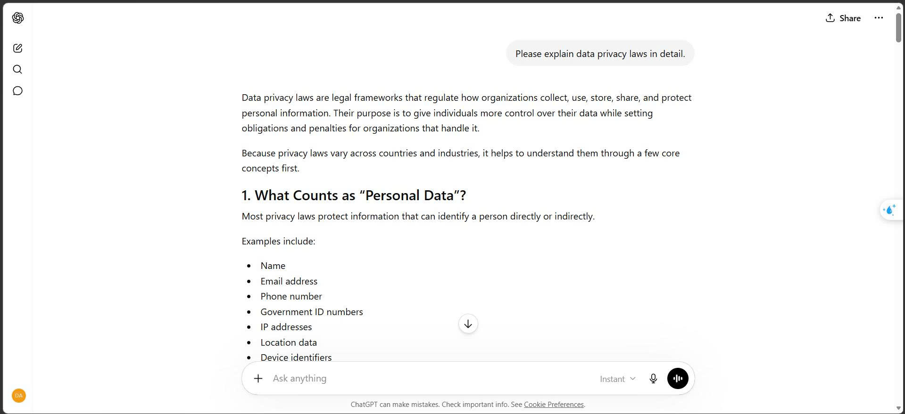

# Lab 2: Phân tích so sánh Sản phẩm AI (Ngành Tìm kiếm)
## Perplexity Pro Search vs ChatGPT Search
**Thành viên:** 2A202600025 & 2A202600480
**Nhiệm vụ chung:** "Giải thích NĐ 13/2023 bảo vệ dữ liệu cá nhân của Việt Nam — áp dụng cho startup AI thế nào? Cho tôi 3 điều quan trọng nhất phải làm."

---

# S1 — Product Moment

### Perplexity
*   **Entry Point**: Giao diện tối giản tập trung hoàn toàn vào ô tìm kiếm ("Where knowledge begins"). Trải nghiệm người dùng được thiết kế chuyên biệt cho việc tra cứu thông tin (Search-first).
*   

### ChatGPT Search
*   **Entry Point**: Giao diện chat truyền thống với biểu tượng "Web Search" tích hợp. Trải nghiệm được thiết kế theo hướng hội thoại (Chat-first), tính năng search đóng vai trò bổ trợ.
*   

---

# S2 — Workflow Evidence (Friction)

### Perplexity
*   *Ưu điểm*: Trình bày danh sách nguồn (Sources) to rõ ngay trên cùng, trước khi đọc câu trả lời. 
*   *Friction*: Giao diện chat liên tục đôi khi làm mất bối cảnh tìm kiếm ban đầu nếu hỏi sang một chủ đề hoàn toàn khác.

### ChatGPT Search
*   *Ưu điểm*: Văn phong tự nhiên, có khả năng suy luận sâu và liên kết với các framework khác (ví dụ: yêu cầu viết thêm code bảo mật cho NĐ 13/2023).
*   *Friction*: Trích dẫn nguồn (Citations) nhỏ, dạng `[1]`, `[2]` ẩn trong câu, người dùng phải tốn thêm thao tác click để mở thanh bên (sidebar) kiểm chứng nguồn.

---

# S3 — Output & Trust

### Perplexity
*   **Tín hiệu đáng tin (Trust signals)**: Rất cao. Luôn hiển thị cụ thể trích xuất thông tin nào từ website nào (ví dụ: Thư viện Pháp luật, Bộ Công An).
*   Khả năng Hallucination thấp do bị ép bám sát vào Context thu hồi được từ web.
*   

### ChatGPT Search
*   **Tín hiệu đáng tin**: Ở mức khá. Đôi khi model trộn lẫn kiến thức pre-training (đã học từ trước) với kiến thức Search được, khiến việc xác minh (verify) khó khăn hơn.
*   

---

# S4 — Business Signal

### Mức giá & Value
*   **Perplexity**: Gói Free (giới hạn Pro Search) và Pro ($20/tháng). Giá trị cốt lõi là **Tốc độ (Speed)** và **Tính xác thực (Capability)** cho việc nghiên cứu.
*   **ChatGPT Plus**: Gói Free (giới hạn GPT-4o) và Plus ($20/tháng). Giá trị cốt lõi là **Sự đa dụng (Capability)** — mua 1 được tất cả (Code, Data, Search, Voice).

---

# S5 — Product Judgment (1/3)

*   **S5.1 Verdict**: 
    *   **Perplexity**: **Strong** (Trong ngách Research/Search chuyên sâu).
    *   **ChatGPT Search**: **Strong** (Cho mục đích sử dụng đa dụng hàng ngày).
*   **S5.2 User base**: Perplexity (~10-15 triệu MAU - đầu 2024). ChatGPT (>200 triệu WAU - Thống trị tuyệt đối).
*   **S5.3 Doanh thu / Pricing power**: Perplexity (~10-20 triệu USD ARR). ChatGPT (>1.6 tỷ USD ARR). Cả hai đều có pricing power mạnh ở mức $20/tháng.

---

# S5 — Product Judgment (2/3)

*   **S5.4 Moat phân tích**:
    *   *Perplexity*: Dựa vào **Data Moat** (Chỉ mục web AI tự build) và **Brand Moat** ("The AI Search Engine"). Tuy nhiên *Distribution Moat* yếu trước Google/Apple.
    *   *ChatGPT*: **Brand Moat** khổng lồ (Từ đồng nghĩa với AI). **Distribution Moat** đang mở rộng nhờ tích hợp Apple Intelligence.
*   **S5.5 Data flywheel**:
    *   *Perplexity*: Truy vấn user -> Cải thiện thuật toán xếp hạng -> Trả lời chính xác hơn. Ít compounding asset độc quyền từ user.
    *   *ChatGPT*: Dữ liệu chat -> RLHF -> Cải thiện khả năng suy luận của model nền tảng. Compounding cực mạnh.

---

# S5 — Product Judgment (3/3)

*   **S5.6 Niche Down + AI Feature Map**:
    *   *Perplexity*: Niche rõ ràng (Information Retrieval). Trực tiếp tối ưu User Value là sự chính xác.
    *   *ChatGPT*: Không Niche Down. Định hướng "Everything App".
*   **S5.7 Spark → Loop → System**: Cả hai đều vượt qua Spark, đang ở giai đoạn **Loop** (user retention cao) và tiến tới xây dựng **System** (API, Enterprise integration).
*   **S5.8 Liên hệ Lab 1 (Disruption)**: Perplexity đang cố gắng disrupt Google Search (Marketplace thông tin) tương tự cách Midjourney disrupt Shutterstock. Cả hai đánh vào **Shift 1 (Do the work for me)**: AI tự tổng hợp thay vì bắt người dùng mở 10 đường link.
